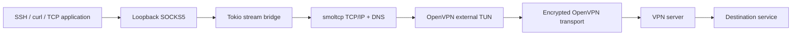

# OvpnLane

[](https://github.com/debba/ovpnlane/actions/workflows/ci.yml)
[](https://github.com/debba/ovpnlane/releases)
[](LICENSE)

**A cross-platform OpenVPN-to-SOCKS5 proxy built with Rust.**

Use SSH, SFTP, Git, curl or another TCP application through OpenVPN without
sending the rest of your computer's traffic through the VPN. OvpnLane creates
a local SOCKS5 endpoint and an in-process TCP/IP stack. It needs **no Docker,
virtual machine, kernel TUN device, administrator privileges or changes to
system routes and DNS** to establish the VPN.

The application and TCP/IP stack are Rust. OpenVPN protocol handling uses
**OpenVPN 3 Core**, compiled into the executable through the third-party
[openvpn-connect bindings](https://github.com/networks-rs/openvpn-connect-rs).
This is not a pure-Rust implementation of the OpenVPN wire protocol and is
not an official OpenVPN product.

## Contents

- [Install](#install)
- [Update](#update)
- [Quick start](#quick-start)
- [SSH, SFTP and Git](#ssh-sftp-and-git)
- [curl and DNS](#curl-and-dns)
- [Authentication](#authentication)
- [Command reference](#command-reference)
- [How it works](#how-it-works)
- [Compatibility and limitations](#compatibility-and-limitations)
- [Troubleshooting](#troubleshooting)
- [Build from source](#build-from-source)
- [Tests and releases](#tests-and-releases)
- [Sources and acknowledgments](#sources-and-acknowledgments)
- [License](#license)

## Install

### macOS and Linux

Install the latest stable GitHub release:

```sh
curl -fsSL https://raw.githubusercontent.com/debba/ovpnlane/main/install.sh | sh
```

The installer detects the OS and CPU, resolves the latest release, downloads the
matching archive and verifies its SHA-256 checksum. It checks the executable's
version before replacing the destination. Installation defaults to
`~/.local/bin`; the script does not invoke `sudo` or modify your shell files.

If that directory is not already on PATH, add this line to your shell
configuration and open a new terminal:

```sh
export PATH="$HOME/.local/bin:$PATH"
```

Select a version and installation directory:

```sh
curl -fsSL https://raw.githubusercontent.com/debba/ovpnlane/main/install.sh \
  | OVPNLANE_VERSION=0.0.2 OVPNLANE_INSTALL_DIR="$HOME/bin" sh
```

To inspect the installer first:

```sh
curl -fsSL https://raw.githubusercontent.com/debba/ovpnlane/main/install.sh -o install.sh
less install.sh
sh install.sh
```

The script requires a POSIX shell, curl, tar and standard Unix utilities, plus
`sha256sum` or `shasum`. Linux archives require glibc; the installer rejects
musl/Alpine. Re-running it installs the selected release into the same directory.

### Windows and manual downloads

Download the appropriate archive and its `.sha256` file from
[GitHub Releases](https://github.com/debba/ovpnlane/releases/latest).

| Release archive for 0.0.2 | Platform / build environment |
| --- | --- |
| `ovpnlane-0.0.2-macos-arm64.tar.gz` | Apple Silicon; built on macOS 15 |
| `ovpnlane-0.0.2-macos-x86_64.tar.gz` | Intel; built on macOS 15 |
| `ovpnlane-0.0.2-linux-x86_64.tar.gz` | Linux x86_64; Ubuntu 24.04 with glibc |
| `ovpnlane-0.0.2-windows-x86_64.zip` | Windows x86_64; Windows Server 2022 / MSVC |

The build environments are the CI baseline, not a guarantee of compatibility
with older OS/runtime versions. Linux ARM64 and musl packages are not published
in this release. Standard platform runtime libraries are required, including
the MSVC runtime on Windows. macOS binaries are not notarized and Windows
binaries are not Authenticode-signed.

On Windows, extract the ZIP into a directory you own, such as
`$env:LOCALAPPDATA\OvpnLane`, and add that directory to your user PATH:

```powershell
ovpnlane.exe --version
ovpnlane.exe --config "$env:USERPROFILE\Documents\client.ovpn"
```

Verify the ZIP before extracting:

```powershell
Get-FileHash .\ovpnlane-0.0.2-windows-x86_64.zip -Algorithm SHA256
Get-Content .\ovpnlane-0.0.2-windows-x86_64.zip.sha256
```

Compare the hashes. On macOS use `shasum -a 256 -c ARCHIVE.sha256`; on Linux use
`sha256sum -c ARCHIVE.sha256`, with both downloaded files in the same directory.
Checksums detect corrupted or mismatched downloads; they are not a separate
publisher signature.

## Update

The command experience follows
[TuxCleaner](https://github.com/debba/tuxcleaner), adapted to OvpnLane's platforms:

```sh
ovpnlane update --check
ovpnlane update --dry-run
ovpnlane update
ovpnlane update --yes
ovpnlane update --version 0.0.2 --yes
```

- `--check` queries GitHub and checks for the archive and checksum matching your
  platform. It does not download or replace the executable.
- `--dry-run` shows the selection and, when installation is needed, its destination.
- `update` selects the latest stable release and asks for confirmation.
- `--yes` skips confirmation and is required for non-interactive installation.
- `--version` selects an exact release, permitting reinstalls and downgrades.

The updater verifies SHA-256, extracts only the expected regular executable,
checks its reported version, and uses
[self-replace](https://docs.rs/self-replace/1.5.0/self_replace/) for replacement.
Downloads have size limits and require HTTPS. The installation directory must
be writable. No automatic background updates or checks run during a VPN session.

Update requests use the normal Internet connection and do not require a VPN
profile. Updating does not rewrite profiles, credentials, SSH configuration or
shell settings. An existing VPN process runs its current version until restarted.

## Quick start

Obtain a client `.ovpn` profile and credentials from your VPN administrator.
Its `remote` server must be reachable **before** the VPN connects.

```sh
ovpnlane --config /path/to/client.ovpn
```

Relative certificate and key paths are resolved against the profile's directory.
Required credentials are prompted; password input is hidden.

Wait for `CONNECTED`. The default SOCKS5 address is `127.0.0.1:1080`.
The earlier `SOCKS5 listening` message only means the local port has opened.
Requests arriving before VPN readiness fail rather than connecting directly
to their destination. Press Ctrl+C to stop.

Check parsing and authentication requirements without connecting:

```sh
ovpnlane --config /path/to/client.ovpn --check
```

This checks configuration, not server reachability or credential acceptance.

## SSH, SFTP and Git

A SOCKS5 endpoint is not an SSH server: use an SSH `ProxyCommand`.
On macOS or Linux with an OpenBSD-compatible `nc`, add to `~/.ssh/config`:

```sshconfig
Host work-ubuntu
    HostName 10.8.0.10
    User myuser
    Port 22
    ProxyCommand nc -X 5 -x 127.0.0.1:1080 %h %p
```

With OvpnLane connected:

```sh
ssh work-ubuntu
sftp work-ubuntu
scp report.txt work-ubuntu:/tmp/
git clone work-ubuntu:/srv/git/example.git
```

Replace the example address and SSH username. SSH authentication is separate
from VPN authentication: keys, agents and host-key checks stay with your SSH
client. See OpenSSH's
[ProxyCommand documentation](https://man.openbsd.org/ssh_config#ProxyCommand)
and OpenBSD's [nc manual](https://man.openbsd.org/nc).

On Windows, install Nmap's Ncat and put it on PATH, then use:

```sshconfig
Host work-ubuntu
    HostName 10.8.0.10
    User myuser
    ProxyCommand ncat --proxy 127.0.0.1:1080 --proxy-type socks5 %h %p
```

See [Ncat proxy options](https://nmap.org/ncat/guide/ncat-proxy.html).
For multiple VPNs, use different `--listen` ports and point each SSH alias at
its corresponding SOCKS listener.

## curl and DNS

Submit the hostname to SOCKS so it is resolved through VPN DNS:

```sh
curl --socks5-hostname 127.0.0.1:1080 https://internal.example
curl --proxy socks5h://127.0.0.1:1080 https://internal.example
```

curl documents proxy-side resolution under
[--socks5-hostname](https://curl.se/docs/manpage.html#--socks5-hostname).
An application that resolves a name locally before submitting an IP to SOCKS
has already made that lookup outside OvpnLane.

DNS servers normally come from the VPN's pushed configuration. Override them:

```sh
ovpnlane --config client.ovpn --dns 10.8.0.1 --dns 10.8.0.2
```

Destination DNS queries use the packet tunnel, with no system-resolver fallback.
If the VPN supplies no DNS, use `--dns` or an IP address. The VPN server's own
hostname is resolved through the normal host network before the tunnel exists.

## Authentication

The CLI supports client certificates, VPN username/password authentication,
encrypted private keys and static challenge responses when required by the
evaluated profile. Username/password validation happens on the **VPN server
during connection**, not when credentials are entered.

```sh
ovpnlane --config client.ovpn --username vpn-user
```

Pass `--save-password` to save the password in the operating system's credential
store (Keychain on macOS, Credential Manager on Windows, and Secret Service on
Linux). It is saved only after the VPN reports a successful connection; an
`AUTH_FAILED` or any failure before connection never stores it. Saved passwords
are retrieved automatically on later runs for the same profile and username,
without requiring `--save-password` again. Set `OVPN_PASS` together with
`--save-password` to replace a saved password after successful authentication.

For automation, prepare a private two-line file containing the username on line
1 and password on line 2:

```sh
chmod 600 /path/to/credentials.txt
ovpnlane --config client.ovpn --auth-file /path/to/credentials.txt --non-interactive
```

Alternatively inject credentials through your process manager's environment:

| Variable | Meaning |
| --- | --- |
| `OVPN_USER` | VPN username; also configurable with `--username` |
| `OVPN_PASS` | VPN password when `--auth-file` is not used |
| `OVPN_KEY_PASS` | Encrypted private-key password |
| `OVPN_RESPONSE` | Static challenge response |

`--non-interactive` fails instead of prompting when required values are absent.
OvpnLane does not generate credential files or intentionally log passwords,
tokens, certificate bodies or private keys. Keep profiles and credentials out
of public repositories. Static challenges do not imply support for browser
SSO or interactive dynamic challenges.

The [OpenVPN manual](https://openvpn.net/community-docs/community-articles/openvpn-2-6-manual.html)
describes directives including `remote`, `auth-user-pass`, `remote-cert-tls`,
`verify-x509-name`, `tls-auth` and `tls-crypt`. Accepted profiles are determined by
OpenVPN **3 Core** and the binding, not every option in the OpenVPN 2 executable.

## Command reference

```text
ovpnlane --config <PROFILE> [OPTIONS]
ovpnlane update [--check | --dry-run] [--version <VERSION>] [--yes]
```

| Connection option | Default / behavior |
| --- | --- |
| `-c, --config PATH` | Required profile |
| `-l, --listen ADDRESS` | `127.0.0.1:1080`; loopback only |
| `--dns IP` | Repeatable VPN DNS override |
| `--username USER` | VPN username |
| `--auth-file PATH` | Two-line username/password file |
| `--save-password` | Save in the system keychain after successful authentication |
| `--non-interactive` | Disable credential prompts |
| `--check` | Evaluate profile and exit |
| `--connect-timeout SECONDS` | `30`; range 1–300 |
| `--idle-timeout SECONDS` | `600`; `0` disables |
| `--max-connections COUNT` | `128`; range 1–4096 |
| `-v, --verbose` | Extra connection diagnostics |
| `-V, --version` | Print application version |
| `-h, --help` | Help, also available for `update` |

The connection timeout applies to VPN startup and each proxied DNS/TCP request.
DNS lookup and TCP setup share a per-request deadline. SOCKS negotiation has a
separate 10-second timeout. Logs go to stderr; `RUST_LOG=ovpnlane=debug` enables
diagnostics. In `update`, `--version` selects a release.

## How it works



[smoltcp](https://github.com/smoltcp-rs/smoltcp) supplies the in-process TCP/IP
stack. OvpnLane connects an IP-packet device to the binding's external TUN
callbacks. OpenVPN Core handles the encrypted transport and Tokio handles
local TCP sockets. VPN addresses and DNS settings are applied to the internal
stack, not to host networking.

| Module | Responsibility |
| --- | --- |
| [main.rs](src/main.rs) | CLI, profile, credentials and lifecycle |
| [vpn.rs](src/vpn.rs) | OpenVPN callbacks, packet tunnel and diagnostics |
| [netstack.rs](src/netstack.rs) | TCP streams, packet queues and DNS |
| [socks.rs](src/socks.rs) | SOCKS5 negotiation and forwarding |
| [settings.rs](src/settings.rs) | Address, DNS and MTU configuration |
| [update.rs](src/update.rs) | Release selection, verification and installation |

VPN stops and replacement tunnels discard the previous stack and close its
streams. Generation identifiers keep stale packets out of a new tunnel.
A SOCKS success reply is sent only once the destination TCP connection is established.

## Compatibility and limitations

- SOCKS5 **CONNECT** supports IPv4, IPv6, domain names and TCP half-close.
  BIND and UDP ASSOCIATE return command-not-supported; see the command and
  address types in [RFC 1928](https://www.rfc-editor.org/rfc/rfc1928).
- OpenVPN transport can be UDP or TCP. UDP transport does not enable SOCKS UDP forwarding.
- SOCKS uses no-auth on loopback. Other local processes can use the proxy;
  it does not isolate applications or local users.
- DNS uses UDP without TCP retry, search-domain expansion or Happy Eyeballs.
  Dual-stack tunnels try A first, falling back to AAAA after an empty/failed A
  query. Only the first returned address is used. Use ASCII/punycode hostnames.
- TCP buffers, connection counts and inbound packet queues are bounded.
  This initial release has no published performance benchmark.
- Existing TCP streams do not survive VPN reconnection; applications must reconnect.
- TAP, compression, DCO, external PKI/smart cards, browser SSO and interactive
  dynamic challenges are not supported by this CLI.
- A server `PUSH_UPDATE` requires fresh configuration and is reported as an error.
  Restart OvpnLane if the Core ends the session.
- The binding enforces server certificate policy; OvpnLane requires
  `remote-cert-tls server`. Do not disable identity checks to bypass certificate errors.
- The server controls routing and access rules. A connected tunnel does not
  guarantee access to every internal service.

## Troubleshooting

| Symptom | What to check |
| --- | --- |
| `SOCKS5 listening` without `CONNECTED` | The listener opened; VPN setup is pending. |
| Timeout with no server reply | Remote address, port/protocol, network/firewall, `tls-auth`/`tls-crypt`. Private endpoints must be reachable before connecting. |
| `AUTH_FAILED` | VPN credentials, MFA requirements and server policy. |
| Certificate failure | CA, validity period, clock and expected server identity. |
| IP works; hostname fails | VPN DNS, `--dns`, and whether the app passes its hostname to SOCKS. |
| SOCKS connection refused | Destination host/port and server access rules. |
| Local bind fails | Port already in use; choose another `--listen`. |
| Update query fails | Internet connectivity, published releases and GitHub API rate limits. |
| Update directory not writable | Reinstall into a directory you own. |
| Download cannot run | OS/architecture/runtime compatibility; build from source if needed. |

Fatal events remain in the final error even when Core returns an empty status.
`--verbose` shows the contacted IP/port and transport. Arbitrary native payloads
are omitted because they can contain tokens; see [vpn.rs](src/vpn.rs).

## Build from source

Requirements: **Rust 1.88+**, CMake, a C++17 compiler and libclang. Cargo's
`vendor` feature statically builds the OpenVPN adapter and LZ4. An OpenVPN
executable and OpenSSL development files are not required to build the app.
See the binding's [build documentation](https://github.com/networks-rs/openvpn-connect-rs#building).

```sh
git clone https://github.com/debba/ovpnlane.git
cd ovpnlane
```

macOS:

```sh
xcode-select --install  # if Command Line Tools are missing
brew install cmake
cargo build --release --locked
./target/release/ovpnlane --version
```

Ubuntu/Debian:

```sh
sudo apt-get install build-essential cmake clang libclang-dev
cargo build --release --locked
./target/release/ovpnlane --version
```

Windows: install Rust MSVC, Visual Studio Build Tools with **Desktop development
with C++**, CMake and LLVM/libclang. In a developer PowerShell:

```powershell
$env:LIBCLANG_PATH = 'C:\Program Files\LLVM\bin'
. .\scripts\windows-env.ps1
cargo build --release --locked
.\target\release\ovpnlane.exe --version
```

Install a source checkout into Cargo's binary directory with
`cargo install --path . --locked`. The build toolchain is not needed to run
a built binary. Static OpenVPN/LZ4 linkage does not remove OS runtime dependencies.

The Windows helper aligns the C++ runtime with Rust, enables MSVC exception
unwinding and supplies the bundled
[TAP public header](vendor/windows/README.md) required by OpenVPN Core's Windows
hardware-address helpers. This is a build dependency; no network driver is installed.

## Tests and releases

```sh
cargo fmt --all -- --check
cargo clippy --all-targets --locked -- -D warnings
cargo test --all-targets --locked
python3 tests/installer.py
sh -n install.sh
```

Packet integration tests join two actual smoltcp stacks in memory. They cover
SOCKS framing, a 512 KiB transfer, half-close, IPv6, tunneled DNS, refusal and
VPN loss. Update tests cover release selection, checksums and constrained archive
extraction. Installer tests use local fixtures without modifying a real installation.

The interoperability test starts a local OpenVPN server with `dev null` and
temporary certificates. It requires Python 3, OpenVPN 2.6+ and OpenSSL:

```sh
python3 scripts/smoke_openvpn.py --binary target/release/ovpnlane
python3 scripts/smoke_openvpn.py --binary target/release/ovpnlane --transport udp
python3 scripts/smoke_openvpn.py --binary target/release/ovpnlane --transport udp --control-key tls-auth
python3 scripts/smoke_openvpn.py --binary target/release/ovpnlane --wrong-server-name
```

Use `--openvpn /path/to/openvpn` and `--openssl /path/to/openssl` when needed.
These tests verify real TLS/certificate and data-channel negotiation without a
kernel interface. They do not test application traffic through a real VPN or
live username/password rejection; packet and diagnostic tests cover those code
paths separately.

[CI](.github/workflows/ci.yml) builds and tests each listed desktop platform.
Linux and macOS also run interoperability tests. See the
[Actions history](https://github.com/debba/ovpnlane/actions) for actual results.

Release tags use `vMAJOR.MINOR.PATCH`. Publishing waits for all platform jobs.
Archives contain the executable, documentation, changelog and generated dependency
license notices, with a separate SHA-256 file.

Package a native build with:

```sh
python3 scripts/package.py --platform macos-arm64
```

Use the platform matching the build; packaging does not cross-compile.

## Sources and acknowledgments

- [OpenVPN 3 Core](https://github.com/OpenVPN/openvpn3): client protocol engine.
- [openvpn-connect 0.1.1](https://docs.rs/openvpn-connect/0.1.1/openvpn_connect/):
  third-party bindings and external TUN integration.
- [smoltcp](https://github.com/smoltcp-rs/smoltcp): userspace TCP/IP stack.
- [Tokio](https://tokio.rs/): asynchronous runtime and local sockets.
- [RFC 1928](https://www.rfc-editor.org/rfc/rfc1928): SOCKS5 protocol.
- [OpenSSH](https://man.openbsd.org/ssh_config) and [Ncat](https://nmap.org/ncat/):
  SSH proxy integration.
- [TuxCleaner](https://github.com/debba/tuxcleaner): reference for the installation
  and release-update command experience.
- [self-replace](https://docs.rs/self-replace/1.5.0/self_replace/):
  desktop executable replacement.

**OvpnLane was developed with assistance from OpenAI Codex**, including
implementation, debugging, tests, documentation and release automation.
Maintained by [debba](https://github.com/debba). AI assistance and automated
tests do not constitute an independent security audit.

## License

OvpnLane is licensed under **MPL-2.0**; see [LICENSE](LICENSE).
Dependencies retain their licenses. [THIRD_PARTY.md](THIRD_PARTY.md) lists
component versions and source availability. Release archives include
`THIRD_PARTY_LICENSES.txt` generated from the locked dependency sources.
